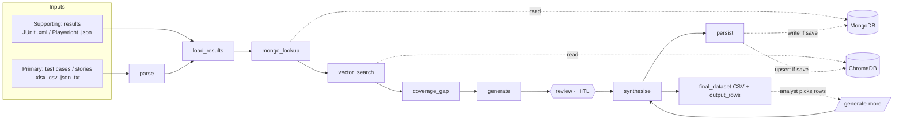
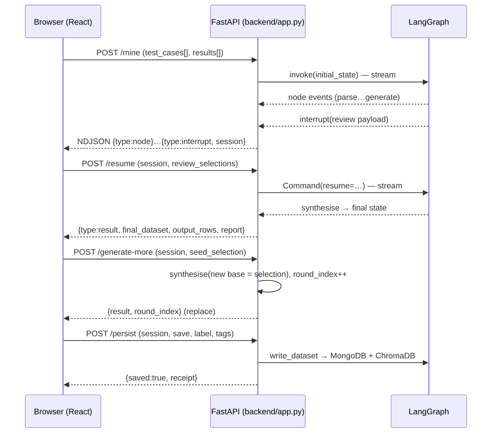
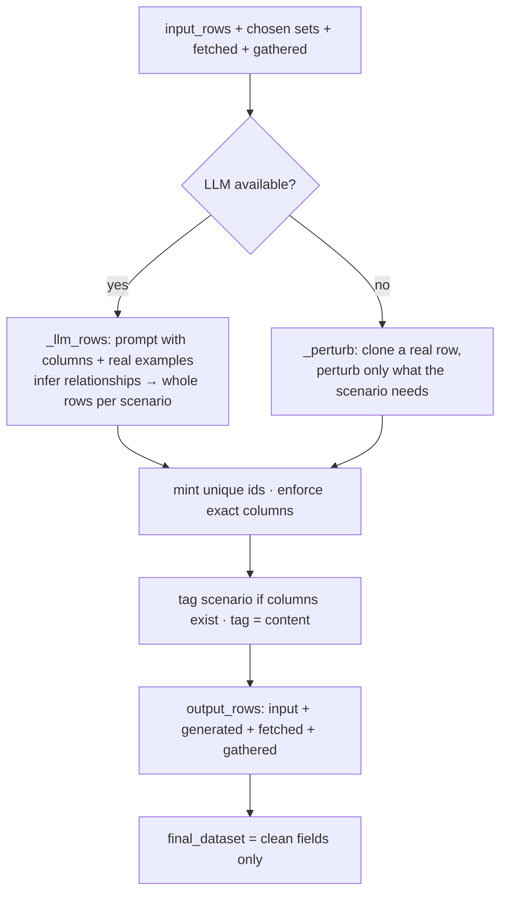

# DATA-FLOW.md — How data moves through the agent

> Companion to [`CONTEXT.md`](CONTEXT.md) / [`ARCHITECTURE.md`](ARCHITECTURE.md). Diagrams are
> Mermaid (render on GitHub). The story: **two inputs → mine → detect gaps → generate → review →
> assemble coherent rows → CSV → optional save-back → iterate.**

---

## 1. The pipeline (data + provenance)

**Sources that feed `synthesise`:** the uploaded `input_rows`, the analyst's chosen value sets,
`existing_data` (**fetched**, MongoDB), `retrieved_data` (**gathered**, ChromaDB). Output rows are
tagged `input` / `generated` / `fetched` / `gathered`.

---

## 2. Request lifecycle (UI ⇄ backend)

The review gate is a real LangGraph `interrupt()`; the session (thread_id) keys the checkpoint.
`/generate-more` and `/persist` operate on the latest working state (`_ROUNDS[session]`).

---

## 3. Data shapes along the way

| Stage | Shape (example) |
|---|---|
| Upload (CSV) | `order_id,email,currency,…` rows |
| `parse` | `input_columns=[order_id,email,…]`, `input_rows=[{order_id:ORD-1,…}]`, `parsed_fields=[ParsedField(email, Identity, [required,email_format], …)]` |
| `load_results` | `result_signals=[{tag, scenario_type:valid, outcome:passed, fields}]`, `seed_values=[{email:[real@…]}]` |
| `mongo_lookup` | `existing_data=[ExistingRecord(label, fields={email:[…]}, rows=[{…}])]` |
| `vector_search` | `retrieved_data=[RetrievedRecord(similarity:0.60, fields, rows)]` |
| `coverage_gap` | `coverage_gaps=[CoverageGap(email, negative, …)]` |
| `generate` | `candidate_sets=[FieldCandidates(email, sets=[gen_A, gen_B, existing])]` |
| `review` (resume) | `review_selections=[ReviewSelection(email, include:true, chosen_set_id:gen_A)]` |
| `synthesise` | `final_dataset=[{order_id,email,…}]` (clean) · `output_rows=[OutputRow(fields, source, row_uid)]` |
| CSV export | `final_dataset` only — original columns, **no source column** |

---

## 4. The generation step in detail

- **inference.py** profiles each column (type, fill-rate, id pattern, correlations) from the data —
  no column names hardcoded.
- **valid** rows stay coherent (clone); **boundary/negative/edge** perturb minimally; **edge** swaps
  carry correlated partners (learned co-occurrence) so links like country↔currency survive.
- Guarantees: originals verbatim & first; output ≥ input; unique ids; mostly-empty stays empty.

---

## 5. Offline & degradation paths

| Condition | Behaviour |
|---|---|
| No `GEMINI_API_KEY` / no quota | deterministic clone-and-perturb (no LLM) |
| MiniLM/stack missing | deterministic hashed embedder (64-dim), threshold 0.40 |
| No MongoDB | local JSON seed (`data/sample_mongo/`) or `[]` + gap |
| No ChromaDB | `[]` + gap (no gathered rows) |
| No result files | no seeds; coverage_gap treats all scenarios as gaps; still generates |
| Malformed input file | skipped with a `gaps` note; never crashes |

Every path still produces a dataset with `output ≥ input`.
